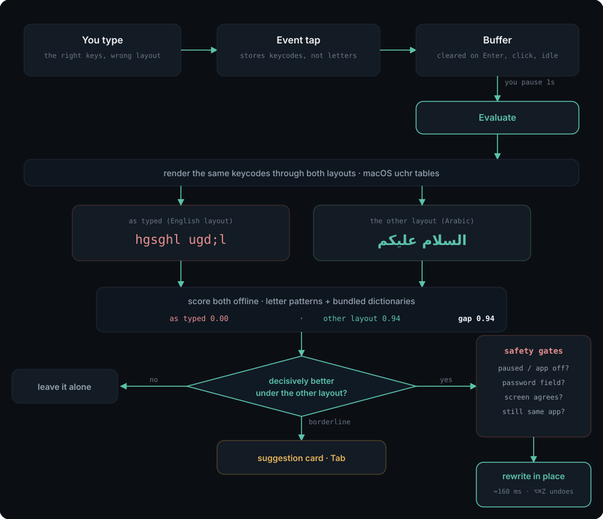

# Dodoma

Dodoma is a macOS menu-bar utility that fixes text typed with the wrong keyboard
layout. Typing Arabic while the US layout is active — or English while Arabic
is — produces mojibake such as `hgsghl` instead of `السلام`. Dodoma watches what
you type, notices when a word only makes sense under the other layout, deletes
what is on screen and types the correction in its place, switching the keyboard
layout as it goes.

It runs as a background agent with no Dock icon, does no networking of any kind,
and keeps everything it observes on the machine. Version 1.0.0, macOS 14 or
newer.

## Why this exists

If you write in two languages all day, you do not think about the keyboard
layout — you think about the sentence. So you switch to English to paste a link
or answer a colleague, then come back to write in Arabic and start typing
without switching back. Nothing warns you. The first sign that anything is wrong
is a line of nonsense on the screen:

    hgsghl ugdj      instead of   السلام عليك
    اخص ه يهي صاشف    instead of   how i did what

The text is not lost, it is simply being drawn through the wrong table: every
key you pressed was the right key. But there is no way to tell macOS that, so
the ritual is always the same — select the line, delete it, find the layout
switcher, and type the whole thing again. A dozen times a day, that is real time
and real irritation, and it interrupts the thing you were actually thinking
about.

Dodoma removes the ritual. It notices the moment you pause, works out that what
you typed is only meaningful under the other layout, and rewrites it in place —
switching the keyboard for you, so the next word you type is already in the
language you meant. You keep writing. In practice you stop noticing that you
ever forgot.

The reverse direction is handled the same way: English typed while Arabic is
active comes out as `اخص ه`, and gets turned back into `how i`.

## How it works

<p align="center">
  
</p>

The diagram is also available as an [editable Excalidraw
canvas](docs/dodoma-how-it-works.excalidraw) — drag it onto
[excalidraw.com](https://excalidraw.com) to rearrange it.

Three illustrated walkthroughs live in `docs/`. Each opens straight from the
browser — no checkout required:

| | What it is | Open it |
|---|---|---|
| **Slide deck** | 13 slides covering the whole pipeline, the safety gates, and the two bugs that only live use found. Arrow keys or space to advance. | [view](https://htmlpreview.github.io/?https://raw.githubusercontent.com/alialhawas/Language-changer/auto-detect-keyboard-language-switch/docs/how-it-works.html) · [source](docs/how-it-works.html) |
| **Diagram** | The flow above as an editable canvas — every box and arrow can be moved. | [open in Excalidraw](https://excalidraw.com/#url=https://raw.githubusercontent.com/alialhawas/Language-changer/auto-detect-keyboard-language-switch/docs/dodoma-how-it-works.excalidraw) · [SVG](docs/how-it-works.svg) |
| **Capture &amp; segmentation** | 10 slides answering one question in detail: is text judged word by word or a line at a time, and how are the words captured in the first place. | [view](https://htmlpreview.github.io/?https://raw.githubusercontent.com/alialhawas/Language-changer/auto-detect-keyboard-language-switch/docs/how-capture-works.html) · [source](docs/how-capture-works.html) |
| **Video** | A narrated walkthrough of the same material, for watching rather than clicking. | [docs/how-it-works.mp4](docs/how-it-works.mp4) |

GitHub serves `.html` as plain text rather than rendering it, which is why the
deck link goes through `htmlpreview` — it fetches the raw file and renders it in
place. Nothing is uploaded anywhere.


Dodoma does not read the characters on your screen and guess. It records the
**key codes** you pressed — physical positions on the keyboard, which are the
same whatever layout is active — and after one second of not typing it renders
that key sequence twice: once through the layout you actually had selected, and
once through the other one. Both renderings are real text produced by macOS's
own `uchr` tables, not a character substitution table, so shifted keys, Caps
Lock and the Arabic layout's `لا` ligature all come out right.

The two renderings are then scored against an offline language model per
language: a letter-bigram probability and a dictionary-coverage fraction over a
list of up to 40,000 words, combined into one number. If the alternate layout scores far
better than what is on screen, and none of the guards fire — too short, mostly
digits, an email address or a path, a word that is legitimate in both languages
— Dodoma acts. How much better "far better" has to be is the **aggressiveness**
setting. A clear win is rewritten silently; a narrower one is offered as a
suggestion card next to the caret; anything else is ignored and forgotten.

## Install

### From a release

Download the disk image, drag the app to Applications, and grant the two
permissions it asks for.

macOS will refuse to open it the first time. The build is signed, but with a
self-signed certificate rather than an Apple Developer ID, so Gatekeeper treats
it exactly as it treats any unnotarised download. To open it anyway: **System
Settings → Privacy & Security**, scroll to the message naming Dodoma, and press
**Open Anyway**. That is once, not every launch.

### With Homebrew

    brew install --cask --no-quarantine alialhawas/dodoma/dodoma

`--no-quarantine` is doing the same job as the Open Anyway button: Homebrew
quarantines casks by default, and a quarantined unnotarised app is refused.

### Building it yourself

    scripts/make-cert.sh    # once — a stable signing identity, so the
                            # permission grants survive rebuilds
    make install            # build, sign, install to /Applications, launch

`make dmg` produces the disk image.

### What proper distribution would take

Everything above works, and none of it is how a shipped Mac app should feel. The
Gatekeeper friction has one cause: the app is not notarised. Fixing that is not a
code change:

| | |
|---|---|
| Apple Developer Program | $99/year |
| Developer ID Application certificate | issued by Apple, replaces the self-signed one |
| Hardened runtime + timestamp | flags on the existing `codesign` step |
| Notarisation | `xcrun notarytool submit`, then `xcrun stapler staple` |

With those, the disk image opens with a double-click and no warning, and the
Homebrew cask no longer needs `--no-quarantine`. Nothing else about the app
changes.


### 1. A stable code-signing identity (once)

```
scripts/make-cert.sh
```

Dodoma needs Accessibility and Input Monitoring permissions, and macOS ties
those grants to the app's code signature. An ad-hoc signature
(`codesign --sign -`) changes on every rebuild, so macOS treats each build as a
new app and drops the grants, forcing re-approval after every `make install`.

`scripts/make-cert.sh` creates a self-signed code-signing certificate named
`Dodoma Dev` in the login keychain and trusts it for code signing. The script
asks for the login keychain password (to set the key partition list) and may
raise a GUI trust prompt. It is idempotent; re-running it when the identity
exists is a no-op.

Building without the certificate still works — `make sign` falls back to ad-hoc
signing and prints a warning.

### 2. Build and install

```
make install
```

This builds in release, assembles `build/Dodoma.app`, signs it, copies it to
`/Applications` and launches it. Install to `/Applications` rather than running
from `build/`: start-at-login registers whatever copy is running, and a login
item pointing into a build directory breaks the first time you `make clean`.

### 3. Grant the two permissions

On a machine with neither grant, the first launch opens a short onboarding
window — the only time Dodoma brings itself to the front. It has a button for
each System Settings pane and ticks each one off as the grant lands. Press
**Done** when finished; it will not open itself again. Menu → **Onboarding…**
reopens it.

Without the window, the same thing from the menu-bar item:

1. **Open Accessibility Settings…** → enable Dodoma under
   Privacy & Security → Accessibility.
2. **Open Input Monitoring Settings…** → enable Dodoma under
   Privacy & Security → Input Monitoring.

The menu's status line refreshes every two seconds, so it flips to
`Active (capturing)` without a restart.

### 4. Start at login

Settings → General → **Start Dodoma at login**. This registers the running copy
with `SMAppService`. macOS may hold the registration back pending approval, in
which case the window says so and offers a link to
System Settings → General → Login Items.

## Using it

### Automatic fixing

Type normally. One second after you stop, Dodoma evaluates what you typed; if it
acts, the text is replaced, the input source switches, the menu-bar item flashes
`⇄ ع/E` and the menu gains a `Last fix:` line naming what was replaced, what
replaced it, in which app and when.

### The suggestion card

Everything worth offering but not worth doing silently appears as a small
floating card next to the caret: borderline scores, applications set to *Suggest
only*, and automatic fixes downgraded because the caret could not be verified.
The card shows the proposed text and the text it would replace, struck through.

- **⇥** accepts, by exactly the same route as an automatic fix.
- **Clicking the card** does the same.
- **Esc**, typing anything else, clicking elsewhere, switching application, or
  four seconds of nothing all put it away. Tab and Esc are consumed only while a
  card is on screen; every other key goes through untouched.
- A card that was turned down is not offered again for the same text in the same
  application for a minute.
- The card never takes keyboard focus. The menu bar does not change and typing
  continues into whatever you were typing into.

It is positioned from the caret where the application reports one, and otherwise
from the focused control, the focused window, the pointer or the screen, in that
order. It works on a second display and shows over full-screen applications.

### Undo — ⌘⌥Z

For **30 seconds** after a fix, ⌘⌥Z puts your original text back and switches
the layout back with it. The menu bar flashes ↩ and the `Last fix:` line gains
`(undone)`. The restored text is not re-fixed for a minute afterwards.

The offer is withdrawn by anything that means the correction is no longer the
last thing in front of the caret: pressing Return, clicking elsewhere, switching
application, switching the layout by hand, or the 30 seconds elapsing. If you
have typed more since the fix, ⌘⌥Z refuses with a ✕ rather than counting
backspaces over your new text. **Undo Last Fix** in the menu does the same
thing, and is greyed out whenever the shortcut would do nothing.

### Pause — ⌘⌥P

Stops all buffering and evaluation. The menu-bar item flashes ⏸ and ▶, the
status line reads `Paused`, and the menu item and the settings switch both
follow. The event tap keeps running so that unpausing needs no permission dance.

### The menu

| Item | |
| --- | --- |
| *Status line* | `Active (capturing)`, `Paused`, `Paused — secure input`, `Needs … permission`, or `Active (capturing) — degraded, click suggestions to accept` |
| *Last fix* | What was replaced, by what, where and when |
| **Undo Last Fix** ⌘⌥Z | Enabled only while there is something to undo |
| **Pause Dodoma** | Same switch as ⌘⌥P |
| **Mode for &lt;app&gt;** | Normal / Suggest only / Off, for the application you were typing in |
| **Settings…** ⌘, | The window below |
| **Onboarding…** | Reopens the first-run walkthrough |
| **Open Accessibility / Input Monitoring Settings…** | The two System Settings panes |
| **Debug Window** | Live buffer, decisions and key log |
| **Quit Dodoma** | |

⌘⌥Z and ⌘⌥P are registered with Carbon and work from anywhere, whatever you are
typing in. The chords on **Settings…** and **Quit Dodoma** are ordinary menu key
equivalents, and Dodoma has no menu bar of its own — it is an accessory app — so
they only fire while one of its own windows is the key window. Use the menu.

### Settings

**General** — aggressiveness, with a line explaining each level; the pause
switch; start at login; and debug logging, which is the only switch that lets
typed text reach `os_log`, under the `decision` category. It is off by default,
and switching it off here also clears the `defaults write` override described
under Troubleshooting.

| Aggressiveness | |
| --- | --- |
| Conservative | Rewrites only on an overwhelming margin. Misses some real mistakes; almost never touches text it should not |
| Balanced | The default. Rewrites clear cases, offers the borderline ones |
| Eager | Rewrites on a smaller margin and offers more. More fixes and more wrong fixes; ⌘⌥Z is the way back |

**Applications** — the per-app policy table. `All other apps` is pinned at the
top and is the default every unlisted application follows. Each row can be
Normal, *Suggest only* or Off; **+ Add app…** adds one from `/Applications`, and
the **−** button removes the override so the app follows the default again.
Removing a row is not the same as switching Dodoma off for it.

A fresh install seeds two groups:

| Mode | Applications seeded on a fresh install |
| --- | --- |
| Suggest only | Terminal, iTerm2, Warp, Ghostty, kitty, Alacritty, WezTerm, Hyper |
| Off | 1Password 7 and 8, Bitwarden, Keychain Access, SecurityAgent, loginwindow |

Adding an application to the seed lists in a later release does not overwrite a
mode you have already chosen for it. Deleting a seeded row deletes the record of
your decision, so the seed returns on the next launch.

**Advanced** — the list of applications for which the verify-before-delete
accessibility read is skipped, the 30-second undo window (read-only) and the two
shortcuts (read-only; rebinding is not supported).

Preferences live in one JSON blob under the `settings` key in `com.ali.dodoma`:

```
defaults read com.ali.dodoma settings
```

## Safety

Dodoma presses Delete in applications it does not own. Five independent things
stop it from doing that to text it should not:

- **Secure input.** `IsSecureEventInputEnabled()` is polled every second, re-read
  on every application switch, and read again at the moment of evaluation. While
  it is on — login window, `sudo`, most password fields — the buffer is dropped
  and the menu reads `Paused — secure input`.
- **Secure fields.** Before anything is shown or applied, the focused element is
  checked for the accessibility secure-text-field subrole. A password field
  drops the buffer, and nothing about it is published to the debug window or the
  log.
- **Terminals suggest only.** A wrong-layout rewrite in a shell is a command
  being retyped behind your back, and a mis-sized backspace burst there can send
  a half-deleted command to a running process.
- **Verify before delete.** Before the first backspace, Dodoma reads the text in
  front of the caret over the accessibility API and checks that it is exactly
  what it recorded you typing. If it does not match, or the application will not
  report its caret, the automatic fix is downgraded to a suggestion. The
  frontmost application is re-checked before every single event in the burst, so
  switching away mid-fix stops it within a couple of keystrokes.
- **Undo.** ⌘⌥Z, above, for the fixes that were wrong anyway.

Plus the two switches you control: **Pause**, and **Off** for an application.

## Troubleshooting

**The status line is stuck on "Needs … permission".** macOS caches the grant
against the code signature. If you have rebuilt with an ad-hoc signature, the
grant belongs to the previous build. Run `scripts/make-cert.sh`,
`make install`, then reset and re-grant:

```
scripts/reset-tcc.sh    # resets the two privacy grants only
```

Then remove any stale `Dodoma` entries from both System Settings panes with the
`−` button before re-adding the new build.

**Nothing is being fixed.** Check, in order: the status line says
`Active (capturing)`; `make logs` shows `language models loaded in NNN ms` and
not `language models failed to load`; the application is not set to *Off* or
*Suggest only* in Settings → Applications; both an English and an Arabic input
source are enabled in System Settings → Keyboard.

**"degraded, click suggestions to accept".** macOS disabled the event tap twice
inside a minute — usually because the system decided Dodoma was too slow to
respond. Dodoma stops consuming events for the rest of the session as a
precaution: ⇥ and Esc go back to being the application's keys, and suggestion
cards are accepted by clicking them. Quitting and relaunching clears it.

**A fix went wrong.** ⌘⌥Z within 30 seconds. If that window has passed, the
application's own ⌘Z also works — the injection looks like ordinary typing to
it, so it may take several presses.

**Logs.**

```
make logs   # log stream --debug --info for subsystem com.ali.dodoma
```

The `decision` category is the only one that can carry typed text, and only when
debug logging is on. Turn it on from Settings → General, or:

```
defaults write com.ali.dodoma debugLogging -bool YES
```

The settings switch clears that key when you switch it off; `defaults write …
-bool NO` also works.

**The debug window.** Menu → **Debug Window** shows the live buffer, the last
decision with both scores and the guards that fired, and the last 50 key events.
Its contents are sensitive — it is the one place typed text is displayed.

### Nothing happens in one particular app

Before deleting anything, Dodoma asks the focused app what text sits in front of
the caret, and refuses to rewrite what it cannot confirm. Most apps answer.
Some do not: an app that draws its editor in a **WKWebView** — a native app with
a web view inside it, as opposed to an Electron app like Slack — generally
cannot answer, so fixes there are offered as a suggestion rather than applied.

If you trust a specific app, list it in `axVerifySkip` and Dodoma will act on
its own record of your keystrokes there instead:

    /usr/bin/python3 - <<'EOF'
    import subprocess, plistlib, json
    raw = subprocess.run(["defaults","export","com.ali.dodoma","-"],capture_output=True).stdout
    d = plistlib.loads(raw); s = json.loads(bytes(d["settings"]).decode())
    s["axVerifySkip"] = sorted(set(s.get("axVerifySkip", [])) | {"com.example.app"})
    d["settings"] = json.dumps(s, separators=(",",":")).encode()
    open("/tmp/dodoma.plist","wb").write(plistlib.dumps(d))
    EOF
    defaults import com.ali.dodoma /tmp/dodoma.plist
    pkill -x Dodoma; open /Applications/Dodoma.app

The undo hotkey is the safety net for those apps, since the screen is no longer
being checked before the delete.

## Manual verification runbook

[`docs/manual-checklist.md`](docs/manual-checklist.md) is the full 90-row
verification pass: permissions and capture, the automatic fix, the safety layer,
suggestions, undo, and the settings surface, with the expected outcome for each
and the six must-run rows marked. Nothing in it can be checked by the test
suite, and the destructive path is live in every application by default, so it
is worth a run before trusting a build.

## Command-line harness

The executable also runs headless, with no permissions required:

```
swift run Dodoma --render "HC MV; HKH HSMDIH HGDML"
swift run Dodoma --score  "please send me the report"
swift run Dodoma --decide "HC MV; HKH HSMDIH HGDML" [--lang en|ar] [--aggressiveness balanced]
swift run Dodoma --eval   Tests/DodomaCoreTests/Fixtures/corpus.tsv
```

- `--render` maps the Latin text to US/ANSI key codes and prints what those key
  codes would produce under every enabled keyboard layout, once per caps mode.
  For the example above the Arabic lines read `اذ ودك انا اسويها اليوم`.
- `--score` prints the English and Arabic bigram, dictionary-coverage and
  combined scores for the text.
- `--decide` replays the text as keystrokes under the layout it was typed on
  (guessed from the script unless `--lang` says otherwise), then prints the
  candidate region, both scores, the caps mode chosen, the guards that fired and
  the verdict.
- `--eval` runs a labelled `text<TAB>expected` corpus and prints a confusion
  matrix with per-class precision and recall. It exits non-zero if any row
  labelled `ignore` was auto-applied.

`--decide` and `--eval` need both an English and an Arabic input source enabled
on the machine.

## Building from source

- macOS 14 or newer.
- Swift 5.9 or newer, from the Xcode Command Line Tools
  (`xcode-select --install`). `Package.swift` declares
  `swift-tools-version: 5.9`; the package is developed and tested against
  Swift 6.2 in language mode 5.
- No Xcode project; everything builds from `Package.swift` via `make`.

```
make build      # swift build -c release
make bundle     # assemble build/Dodoma.app
make sign       # sign the bundle
make install    # build + bundle + sign, install to /Applications, launch
make run        # build + bundle + sign, launch from build/ without installing
make test       # swift test
make fixtures   # re-snapshot the ABC/Arabic uchr tables used by renderer tests
make ngrams     # regenerate the language models (uv run Tools/build-ngrams.py)
make eval       # run the labelled detection corpus
make logs       # stream os_log output for subsystem com.ali.dodoma
make clean      # remove .build and build
```

The package is three targets: `DodomaCore` (the layout engine, the language
models, the decision function and the undo bookkeeping — all pure), `DodomaAppKit`
(the event tap, the injector, the windows and the menu) and a `Dodoma`
executable that is nothing but the entry point, so that the app-side state
machines can be driven from a test target.

## Language models

Detection is fully offline. `Sources/DodomaCore/Resources` holds a word list of
up to 40k words and a letter-bigram table per language, generated by `Tools/build-ngrams.py`
from the MIT-licensed
[FrequencyWords](https://github.com/hermitdave/FrequencyWords) corpus. That
script is the only thing in the project that touches the network, it only does
so on a developer machine when `Tools/data/` is cold, and its output is
committed. See `Sources/DodomaCore/Resources/LICENSES.md` for attribution.

## Removal

```
scripts/uninstall.sh   # quit, delete /Applications/Dodoma.app, reset grants
scripts/reset-tcc.sh   # reset the two privacy grants only
```

`uninstall.sh` deliberately leaves the `Dodoma Dev` certificate, its private key
and its trust setting in the login keychain, so that reinstalling does not
require another `make-cert.sh` run. To remove those too:

```
security delete-identity -c "Dodoma Dev" -t "$HOME/Library/Keychains/login.keychain-db"
```
